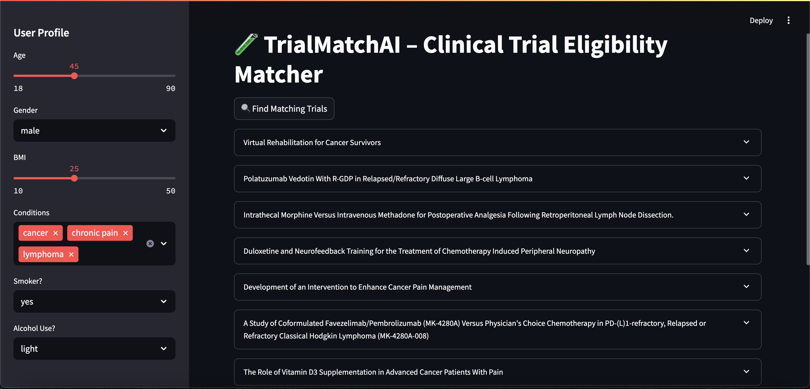
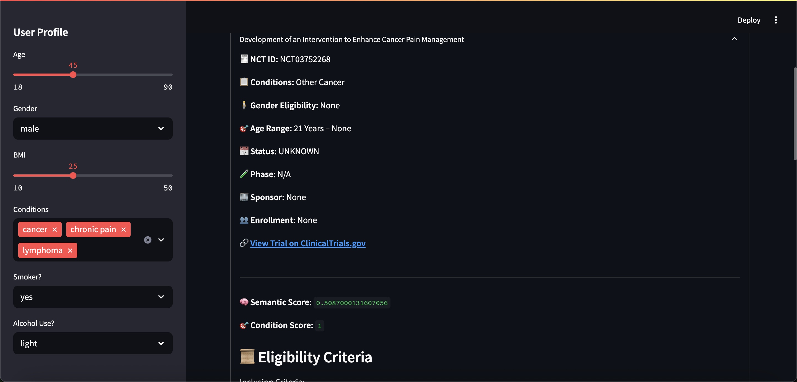
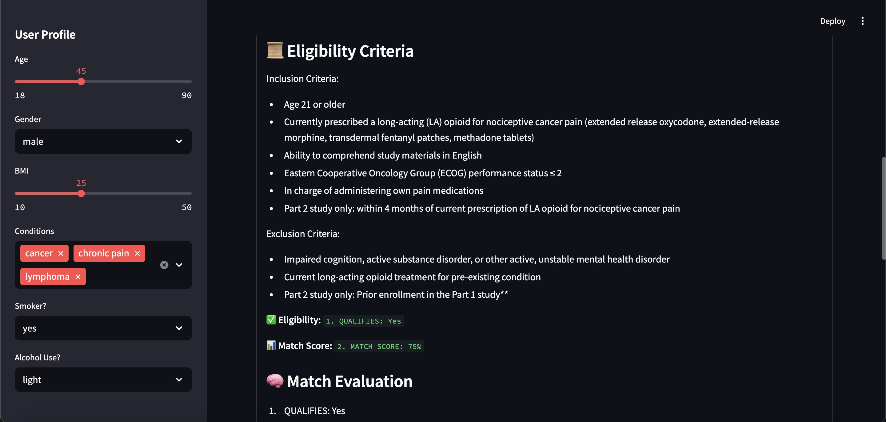
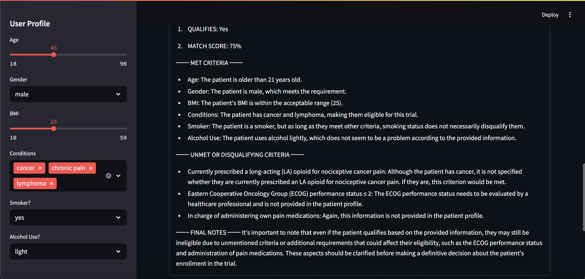

# 🧪 TrialMatchAI – Clinical Trial Eligibility Matcher

**TrialMatchAI** allows users to input personal health parameters (age, gender, BMI, conditions, smoking/alcohol status) and get matched to real-world interventional clinical trials, with semantic ranking and LLM-generated evaluation.

## 📋 Features

- **Streamlit-powered UI** – user-friendly, browser-based input panel.
- **FAISS + SentenceTransformer backend** – retrieves top 20 semantically relevant trials.
- **Condition‑matching filter** – ensures inclusion, no exclusion for any selected condition.
- **LLM explainability** – Ollama-driven evaluation with clear match percentages & reasons.
- **Screenshots included** – visual walkthrough of key flows.

## 📸 Screenshots

<kbd></kbd>
<kbd></kbd>
<kbd></kbd>
<kbd></kbd>

## 🚀 Getting Started

### Requirements

```bash
pip install -r requirements.txt
```

Make sure you have:

- streamlit
- sentence-transformers
- faiss-cpu
- requests
- ollama CLI (e.g., mistral) running locally

### Data Ingestion & Indexing

```bash
python app/trial_ingest.py
python app/vectorize.py
```

### Run the App

```bash
streamlit run app/main.py
```

## 🛠 Key Files

- `app/trial_ingest.py` – fetches interventional, active trials
- `app/vectorize.py` – builds FAISS index
- `app/matcher.py` – filters and scores trial matches
- `app/llm_explainer.py` – calls Ollama LLM for match analysis
- `app/main.py` – Streamlit UI pipeline

## 🧠 Match Logic

- Use user input to semantically search eligibility text.
- Enforce inclusion and exclusion rules based on conditions.
- Score matches by condition coverage and semantic similarity.
- Generate LLM-based match % and detailed explanation.
